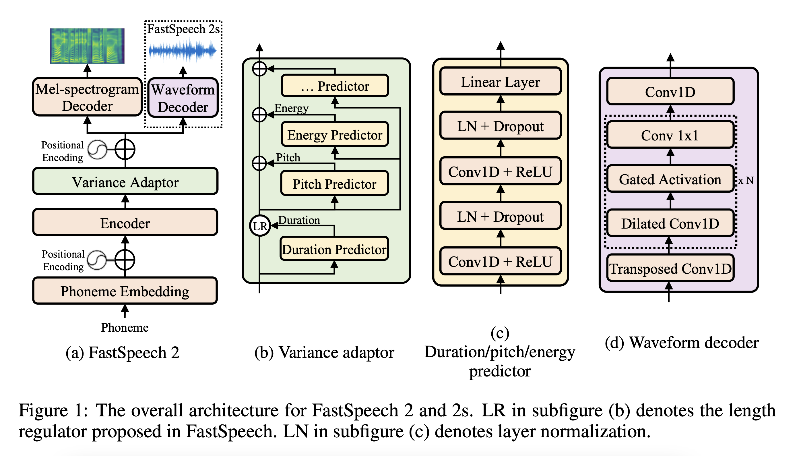
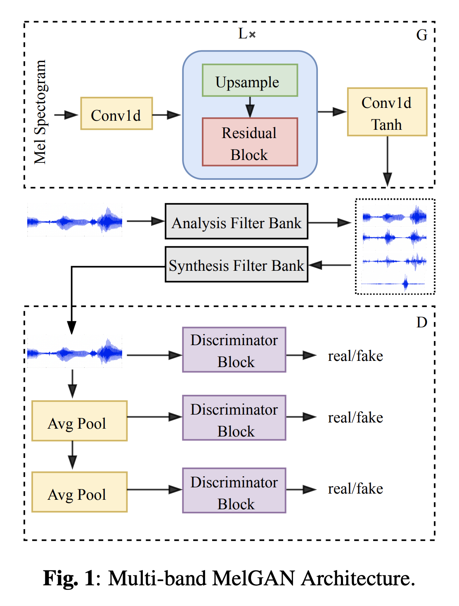
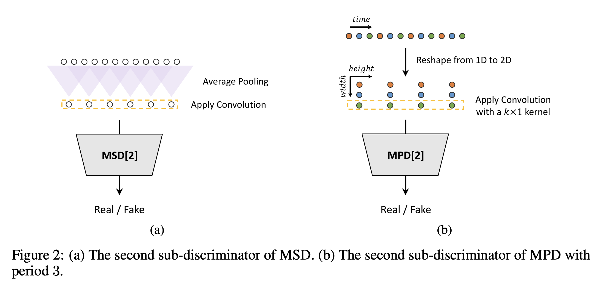

# Introduction

This guide will explain how to train a [LightSpeech](https://arxiv.org/abs/2102.04040) acoustic model and a [Multi-band MelGAN](https://arxiv.org/abs/2005.05106) vocoder model (with a [HiFi-GAN](https://arxiv.org/abs/2010.05646) Discriminator). In particular, we will be training a 44.1 kHz model, with a hop size of 512.

This guide expects you to train an IPA-based model. For now, this tutorial only supports English and Indonesian -- because only these two languages have its correponding IPA-based grapheme-to-phoneme processor added to the custom fork. 

For English, we use [gruut](https://github.com/rhasspy/gruut) and for Indonesian, we use [g2p_id](https://github.com/bookbot-kids/g2p_id). To add support for other languages, you would need a grapheme-to-phoneme converter for that language, and support it as a processor in TensorFlowTTS. We will introduce a separate tutorial for that in the future.

## LightSpeech

LightSpeech follows the same architecture as [FastSpeech2](https://arxiv.org/abs/2006.04558), except with an optimized model configuration obtained via Neural Architecture Search (NAS). In our case, we don't really perform NAS, but use the previously found best model configuration.

{ loading=lazy }

## Multi-band MelGAN

Multi-Band MelGAN is an improvement upon [MelGAN](https://arxiv.org/abs/1910.06711) that does waveform generation and waveform discrimination on a multi-band basis.

<figure markdown>
  { loading=lazy width="500"  }
</figure>

## HiFi-GAN Discrminator

Further, instead of using the original discriminator, we can use the discriminator presented in the HiFi-GAN paper.

{ loading=lazy }

We specifically use the multi-period discriminator (MPD) on the right.