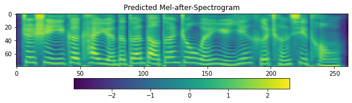

# C++ Inference using TFlite
TensorFlow Lite is an open source deep learning framework for on-device inference. On Android and Linux (including Raspberry Pi) platforms, we can run inferences using TensorFlow Lite APIs available in C++. The repository TensorFlowTTS and TensorFlow Lite help developers run popular text-to-speech (TTS) models on mobile, embedded, and IoT devices.

## TFlite model convert method
Method see [colab notebook](https://colab.research.google.com/drive/1Ma3MIcSdLsOxqOKcN1MlElncYMhrOg3J?usp=sharing#scrollTo=KCm6Oj7iLlu5). This notebook provides a demonstration of the realtime E2E-TTS using TensorflowTTS for Chinese (Using Baker dataset).

**Notes:**
- TensorFlow Lite using C++ doesn't support the TensorFlow operations of Dropout. So the inference function need delete Dropout before converting tflite model, and which doesn't affect the inference result.
For example, fastspeech2 models:
```python
# tensorflow_tts/models/fastspeech2.py
# ...
    def _inference():
        # ...
        # f0_embedding = self.f0_dropout(
        #     self.f0_embeddings(tf.expand_dims(f0_outputs, 2)), training=True
        # )
        # energy_embedding = self.energy_dropout(
        #     self.energy_embeddings(tf.expand_dims(energy_outputs, 2)), training=True
        # )

        f0_embedding = self.f0_embeddings(tf.expand_dims(f0_outputs, 2))

        energy_embedding = self.energy_embeddings(tf.expand_dims(energy_outputs, 2))
        # ...
```

## About Code
- TfliteBase.cpp: A base class for loading tflite-model and creating tflite interpreter. By inheriting from this class, you can implement specific behavior, like Mel-spectrogram and Vocoder.
- TTSFrontend.cpp: Text preprocessor converts string to ID base on desiged phoneme2ID dict, which needs a text to pronunciation module, like g2p for English and pinyin for Chinese.
- TTSBackend.cpp: It contains two-step process - first generating a MEL spectrogram from phoneme ID sequence and then generating the audio waveform by Vocoder.


## Using the demo
A demo of Mandarin TTS and its [tflite-models](https://github.com/lr2582858/TTS_tflite_cpp/releases/tag/0.1.0) are available for linux platform,. 

A TensorFlow Lite static library (**libtensorflow-lite.a**) builded for linux is also available in the directory of ./lib. The method building static libraries for other platforms see the [reference](https://www.tensorflow.org/lite/guide/build_rpi).

```shell
cd examples/cpptflite
mkdir build
cd build
cmake ..
make
```

```shell
./demo 这是一个开源的端到端中文语音合成系统 test.wav
```

In this demo, Mel-generator and Vocoder select FastSpeech2 and Multiband-MelGAN, respectively. And pretrained models to be converted is download from the above colab notebook. Besides, text2ids function in TTSFrontend.cpp is implemented using bash command with C++ (see /demo/text2ids.py) instead of developing a new pronunciation module. In fact, it is not a recommended method, and you should redevelop a appropriate text2ids module, like the code in examples/cppwin.

- Modify model path in /demo/main.cpp
```c++
// /demo/main.cpp
const char* cmd        = "python3 ../demo/text2ids.py";
const char* mapperJson = "../../../tensorflow_tts/processor/pretrained/baker_mapper.json";

const char* melgenfile  = "../models/fastspeech2_quan.tflite";
const char* vocoderfile = "../models/mb_melgan.tflite";

// Init
TTSFrontend ttsfrontend(mapperJson, cmd);
TTSBackend ttsbackend(melgenfile, vocoderfile);
```

## Results
- #### Comparison before and after conversion
  - Before conversion (Python)

  - After conversion (C++)


- #### Adding #3 in text could create pause prosody in audio
```shell
./demo 这是一个开源的#3端到端#3中文语音合成系统 test.wav
```
