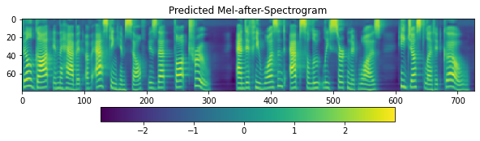
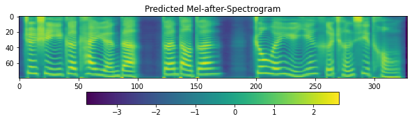

# C++ Inference using TFlite
TensorFlow Lite is an open source deep learning framework for on-device inference. On Android and Linux (including Raspberry Pi) platforms, we can run inferences using TensorFlow Lite APIs available in C++. The repository TensorFlowTTS and TensorFlow Lite help developers run popular text-to-speech (TTS) models on mobile, embedded, and IoT devices.

## TFlite model convert method
Method see [colab notebook](https://colab.research.google.com/drive/1Ma3MIcSdLsOxqOKcN1MlElncYMhrOg3J?usp=sharing#scrollTo=KCm6Oj7iLlu5).

**Notes:**
- Quantization will deteriorate vocoder and bring noise, so the vocoder doesn't do optimization.
- TensorFlow Lite in C++ doesn't support the TensorFlow operation of Dropout. So the inference function need delete Dropout before converting tflite model, and it doesn't affect the inference result.
For example, fastspeech2 models:
```python
# tensorflow_tts/models/fastspeech2.py
# ...
    def _inference():
        # ...
        # f0_embedding = self.f0_dropout(
        #     self.f0_embeddings(tf.expand_dims(f0_outputs, 2)), training=True
        # )
        # energy_embedding = self.energy_dropout(
        #     self.energy_embeddings(tf.expand_dims(energy_outputs, 2)), training=True
        # )

        f0_embedding = self.f0_embeddings(tf.expand_dims(f0_outputs, 2))

        energy_embedding = self.energy_embeddings(tf.expand_dims(energy_outputs, 2))
        # ...
```

## About Code
- TfliteBase.cpp: A base class for loading tflite-model and creating tflite interpreter. By inheriting from this class, you can implement specific behavior, like Mel-spectrogram and Vocoder.
- TTSFrontend.cpp: Text preprocessor converts string to ID based on your desiged phoneme2ID dict, which needs a text to pronunciation module, like g2p for English and pinyin for Chinese.
- TTSBackend.cpp: It contains two-step process - first generating a Mel-spectrogram from phoneme-ID sequence and then generating the audio waveform by Vocoder.


## Using the demo
A demo of English or Mandarin TTS and the [tflite-models](https://github.com/lr2582858/TTS_tflite_cpp/releases/tag/0.1.0) are available for linux platform. The pretrained models to be converted are download from the colab notebook ([English](https://colab.research.google.com/drive/1akxtrLZHKuMiQup00tzO2olCaN-y3KiD?usp=sharing#scrollTo=4uv_QngUmFbK) or [Mandarin](https://colab.research.google.com/drive/1Ma3MIcSdLsOxqOKcN1MlElncYMhrOg3J?usp=sharing#scrollTo=KCm6Oj7iLlu5)). Mel-generator and Vocoder select FastSpeech2 and Multiband-MelGAN, respectively.

**Notes:**
The text2ids function in TTSFrontend.cpp is implemented by using bash command in C++ instead of developing a new pronunciation module (see /demo/text2ids.py). In fact, it is not a recommended method, and you should redevelop a appropriate text2ids module, like the code in examples/cppwin.

**Firstly**, it should compile a Tensorflow Lite static library. The method see the [reference](https://www.tensorflow.org/lite/guide/build_rpi) from the official guidance of Tensorflow.

Execute the following command to compile a static library for linux:
```shell
./tensorflow/lite/tools/make/download_dependencies.sh
./tensorflow/lite/tools/make/build_lib.sh (for linux)
```
(The official also provides different complie methods for other platforms (such as rpi, aarch64, and riscv), see /tensorflow/lite/tools/make/)

Because this process takes much time, so a static library builded for linux is also available ([libtensorflow-lite.a](https://github.com/lr2582858/TTS_tflite_cpp/releases/tag/0.1.0)).

The structure of the demo folder should be:
```
|- [cpptflite]/
|      |- demo/
|      |- src/
|      |- lib/
|          |- flatbuffers/
|          |- tensorflow/lite/
|          |- libtensorflow-lite.a
```
The two folders of flatbuffers/ and tensorflow/lite/ provide the required header files.

**Then**,
```shell
cd examples/cpptflite
mkdir build
cd build
```

**English Demo (using LJSPEECH dataset)**
```shell
cmake .. -DMAPPER=LJSPEECH
make

./demo "Bill got in the habit of asking himself “Is that thought true?”" test.wav
```

**or Mandarin Demo (using Baker dataset)**
```shell
cmake .. -DMAPPER=BAKER
make

./demo "这是一个开源的端到端中文语音合成系统" test.wav
```


## Results
- #### Comparison before and after conversion (English TTS)
  ```
  "Bill got in the habit of asking himself “Is that thought true?” \ 
  And if he wasn’t absolutely certain it was, he just let it go."
  ```
- Before conversion (Python)

  


- After conversion (C++)

  

- #### Adding #3 in chinese text will create pause prosody in audio
```
这是一个开源的端到端中文语音合成系统"
```

```
"这是一个开源的#3端到端#3中文语音合成系统"
```
