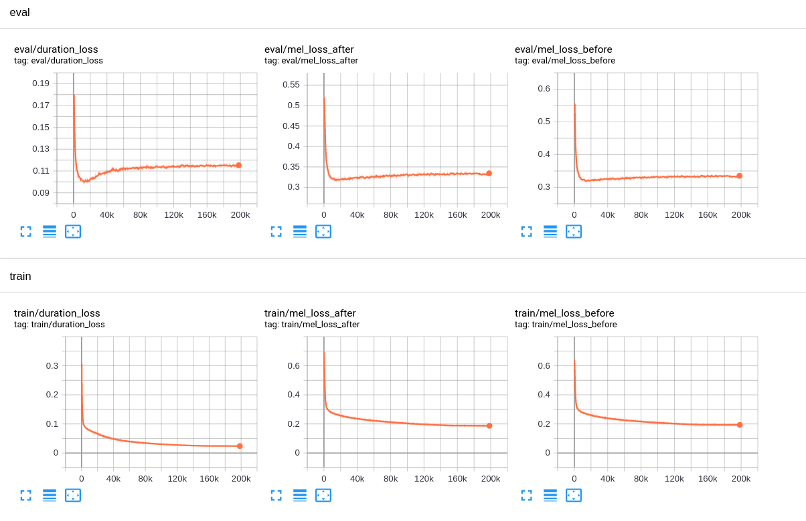

# FastSpeech: Fast, Robust and Controllable Text to Speech
Based on the script [`train_fastspeech.py`](https://github.com/dathudeptrai/TensorflowTTS/tree/master/examples/fastspeech/train_fastspeech.py).

## Training FastSpeech from scratch with LJSpeech dataset.
This example code show you how to train FastSpeech from scratch with Tensorflow 2 based on custom training loop and tf.function. The data used for this example is LJSpeech, you can download the dataset at  [link](https://keithito.com/LJ-Speech-Dataset/).

### Step 1: Create Tensorflow based Dataloader (tf.dataset)
First, you need define data loader based on AbstractDataset class (see [`abstract_dataset.py`](https://github.com/dathudeptrai/TensorflowTTS/tree/master/tensorflow_tts/datasets/abstract_dataset.py)). On this example, a dataloader read dataset from path. I use suffix to classify what file is a charactor, duration and mel-spectrogram (see [`fastspeech_dataset.py`](https://github.com/dathudeptrai/TensorflowTTS/tree/master/examples/fastspeech/fastspeech_dataset.py)). If you already have preprocessed version of your target dataset, you don't need to use this example dataloader, you just need refer my dataloader and modify **generator function** to adapt with your case. Normally, a generator function should return [charactor_ids, duration, mel]. Pls see tacotron2-example to know how to extract durations [Extract Duration](https://github.com/dathudeptrai/TensorflowTTS/tree/master/examples/tacotron2#step-4-extract-duration-from-alignments-for-fastspeech)

### Step 2: Training from scratch
After you redefine your dataloader, pls modify an input arguments, train_dataset and valid_dataset from [`train_fastspeech.py`](https://github.com/dathudeptrai/TensorflowTTS/tree/master/examples/fastspeech/train_fastspeech.py). Here is an example command line to training fastspeech from scratch:

```bash
CUDA_VISIBLE_DEVICES=0 python examples/fastspeech/train_fastspeech.py \
  --train-dir ./dump/train/ \
  --dev-dir ./dump/valid/ \
  --outdir ./examples/fastspeech/exp/train.fastspeech.v1/ \
  --config ./examples/fastspeech/conf/fastspeech.v1.yaml \
  --use-norm 1
  --mixed_precision 0 \
  --resume ""
```

IF you want to use MultiGPU to training you can replace `CUDA_VISIBLE_DEVICES=0` by `CUDA_VISIBLE_DEVICES=0,1,2,3` for example. You also need to tune the `batch_size` for each GPU (in config file) by yourself to maximize the performance. Note that MultiGPU now support for Training but not yet support for Decode.

In case you want to resume the training progress, please following below example command line:

```bash
--resume ./examples/fastspeech/exp/train.fastspeech.v1/checkpoints/ckpt-100000
```

If you want to finetune a model, use `--pretrained` like this with your model filename
```bash
--pretrained pretrained.h5
```

### Step 3: Decode mel-spectrogram from folder ids
To running inference on folder ids (charactor), run below command line:

```bash
CUDA_VISIBLE_DEVICES=0 python examples/tacotron2/decode_fastspeech.py \
  --rootdir ./dump/valid/ \
  --outdir ./prediction/fastspeech-200k/ \
  --checkpoint ./examples/fastspeech/exp/train.fastspeech.v1/checkpoints/model-200000.h5 \
  --config ./examples/fastspeech/conf/fastspeech.v1.yaml \
  --batch-size 32
```

## Finetune FastSpeech with ljspeech pretrained on other languages
Here is an example show you how to use pretrained ljspeech to training with other languages. This does not guarantee a better model or faster convergence in all cases but it will improve if there is a correlation between target language and pretrained language. The only thing you need to do before finetune on other languages is re-define embedding layers. You can do it by following code:

```python
pretrained_config = ...
fastspeech = TFFastSpeech(pretrained_config)
fastspeech._build()
fastspeech.summary()
fastspeech.load_weights(PRETRAINED_PATH)

# re-define here
pretrained_config.vocab_size = NEW_VOCAB_SIZE
new_embedding_layers = TFFastSpeechEmbeddings(pretrained_config, name='embeddings')
fastspeech.embeddings = new_embedding_layers
# re-build model
fastspeech._build()
fastspeech.summary()

... # training as normal.
```

## Results
Here is a learning curves of fastspeech based on this config [`fastspeech.v1.yaml`](https://github.com/dathudeptrai/TensorflowTTS/tree/master/examples/fastspeech/conf/fastspeech.v1.yaml)

### Learning curves


## Some important notes
	
* **DO NOT** apply any activation function on intermediate layer (TFFastSpeechIntermediate).
* There is no different between num_hidden_layers = 6 and num_hidden_layers = 4.
* I use mish rather than relu.
* For extract durations, i use my tacotron2.v1 at 40k steps with window masking (front=4, back=4). Let say, at that steps it's not a strong tacotron-2 model. If you want to improve the quality of fastspeech model, you may consider use my latest checkpoint tacotron2.


## Pretrained Models and Audio samples
| Model                                                                                                          | Conf                                                                                                                        | Lang  | Fs [Hz] | Mel range [Hz] | FFT / Hop / Win [pt] | # iters |
| :------                                                                                                        | :---:                                                                                                                       | :---: | :----:  | :--------:     | :---------------:    | :-----: |
| [fastspeech.v1](https://drive.google.com/drive/folders/1f69ujszFeGnIy7PMwc8AkUckhIaT2OD0?usp=sharing)             | [link](https://github.com/dathudeptrai/TensorflowTTS/tree/master/examples/fastspeech/conf/fastspeech.v1.yaml)          | EN    | 22.05k  | 80-7600        | 1024 / 256 / None    | 195k    |
| [fastspeech.v3](https://drive.google.com/drive/folders/1ITxTJDrS1I0K8S_x0s0tNbym748p9FUI?usp=sharing)             | [link](https://github.com/dathudeptrai/TensorflowTTS/tree/master/examples/fastspeech/conf/fastspeech.v3.yaml)          | EN    | 22.05k  | 80-7600        | 1024 / 256 / None    | 150k    |


## Reference

1. https://github.com/xcmyz/FastSpeech
2. [FastSpeech: Fast, Robust and Controllable Text to Speech](https://arxiv.org/abs/1905.09263)