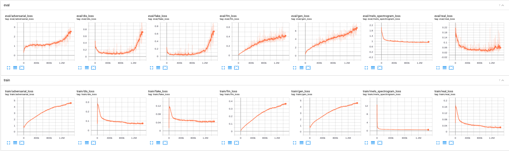

# MelGAN: Generative Adversarial Networks for Conditional Waveform Synthesis
Based on the script [`train_melgan.py`](https://github.com/dathudeptrai/TensorflowTTS/tree/master/examples/melgan/train_melgan.py).

## Training MelGAN from scratch with LJSpeech dataset.
This example code show you how to train MelGAN from scratch with Tensorflow 2 based on custom training loop and tf.function. The data used for this example is LJSpeech, you can download the dataset at  [link](https://keithito.com/LJ-Speech-Dataset/).

### Step 1: Create Tensorflow based Dataloader (tf.dataset)
First, you need define data loader based on AbstractDataset class (see [`abstract_dataset.py`](https://github.com/dathudeptrai/TensorflowTTS/tree/master/tensorflow_tts/datasets/abstract_dataset.py)). On this example, a dataloader read dataset from path. I use suffix to classify what file is a audio and mel-spectrogram (see [`audio_mel_dataset.py`](https://github.com/dathudeptrai/TensorflowTTS/tree/master/examples/melgan/audio_mel_dataset.py)). If you already have preprocessed version of your target dataset, you don't need to use this example dataloader, you just need refer my dataloader and modify **generator function** to adapt with your case. Normally, a generator function should return [audio, mel].

### Step 2: Training from scratch
After you redefine your dataloader, pls modify an input arguments, train_dataset and valid_dataset from [`train_melgan.py`](https://github.com/dathudeptrai/TensorflowTTS/tree/master/examples/melgan/train_melgan.py). Here is an example command line to training tacotron-2 from scratch:

```bash
CUDA_VISIBLE_DEVICES=0 python examples/melgan/train_melgan.py \
  --train-dir ./dump/train/ \
  --dev-dir ./dump/valid/ \
  --outdir ./examples/melgan/exp/train.melgan.v1/ \
  --config ./examples/melgan/conf/melgan.v1.yaml \
  --use-norm 1
  --generator_mixed_precision 0 \
  --resume ""
```

IF you want to use MultiGPU to training you can replace `CUDA_VISIBLE_DEVICES=0` by `CUDA_VISIBLE_DEVICES=0,1,2,3` for example. You also need to tune the `batch_size` for each GPU (in config file) by yourself to maximize the performance. Note that MultiGPU now support for Training but not yet support for Decode.

In case you want to resume the training progress, please following below example command line:

```bash
--resume ./examples/melgan/exp/train.melgan.v1/checkpoints/ckpt-100000
```

If you want to finetune a model, use `--pretrained` like this with the filename of the generator
```bash
--pretrained ptgenerator.h5
```


### Step 3: Decode audio from folder mel-spectrogram
To running inference on folder mel-spectrogram (eg tacotron2.v1), run below command line:

```bash
CUDA_VISIBLE_DEVICES=0 python examples/melgan/decode_melgan.py \
  --rootdir ./prediction/tacotron2.v1/ \
  --outdir ./prediction/tacotron2.v1_melgan.v1/ \
  --checkpoint ./examples/melgan/exp/train.melgan.v1/checkpoints/model-1500000.h5 \
  --config ./examples/melgan/conf/melgan.v1.yaml \
  --batch-size 32
  --use-norm 1
```


## Finetune MelGAN with ljspeech pretrained on other languages
Just load pretrained model and training from scratch with other languages. **DO NOT FORGET** re-preprocessing on your dataset if needed. A hop_size should be 256 if you want to use our pretrained.

## Learning Cuves
Here is a learning curves of melgan based on this config [`melgan.v1.yaml`](https://github.com/dathudeptrai/TensorflowTTS/tree/master/examples/melgan/conf/melgan.v1.yaml)



## Some important notes
	
* We don't need use learning rate decay for melgan.
* A weight-norm tensorflow based layer have many problem about ability to save graph, multi-gpu and convergence problem, i will investigate a solution but at this time, pls set is_weight_norm is False on config.
* After one step generator, **DO NOT FORGET** re-generate y_hat for discriminator training.
* Mixed precision make Group Convolution training slower on Discriminator, both pytorch (apex) and tensorflow also has this problems.

## Pretrained Models and Audio samples
| Model                                                                                                          | Conf                                                                                                                        | Lang  | Fs [Hz] | Mel range [Hz] | FFT / Hop / Win [pt] | # iters |
| :------                                                                                                        | :---:                                                                                                                       | :---: | :----:  | :--------:     | :---------------:    | :-----: |
| [melgan.v1](https://drive.google.com/drive/u/1/folders/1mBwGVchwtNkgFsURl7g4nMiqx4gquAC2)             | [link](https://github.com/dathudeptrai/TensorflowTTS/tree/master/examples/melgan/conf/melgan.v1.yaml)          | EN    | 22.05k  | 80-7600        | 1024 / 256 / None    | 1500k    |


## Reference

1. https://github.com/descriptinc/melgan-neurips
2. https://github.com/kan-bayashi/ParallelWaveGAN
3. https://github.com/tensorflow/addons
4. [MelGAN: Generative Adversarial Networks for Conditional Waveform Synthesis](https://arxiv.org/abs/1910.06711)