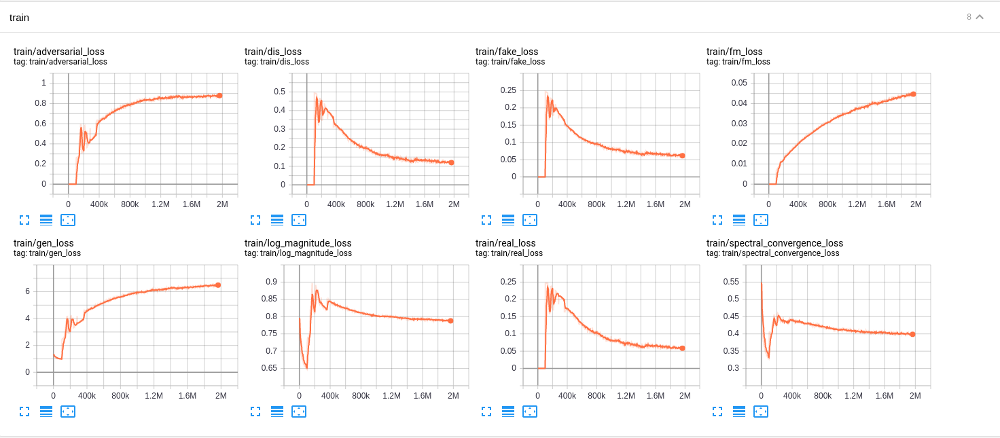

# MelGAN STFT: MelGAN With Multi Resolution STFT Loss
Based on the script [`train_melgan_stft.py`](https://github.com/tensorspeech/TensorFlowTTS/tree/master/examples/melgan_stft/train_melgan_stft.py).

## Training MelGAN STFT from scratch with LJSpeech dataset.
This example code show you how to train MelGAN from scratch with Tensorflow 2 based on custom training loop and tf.function. The data used for this example is LJSpeech, you can download the dataset at  [link](https://keithito.com/LJ-Speech-Dataset/).

### Step 1: Create Tensorflow based Dataloader (tf.dataset)
Please see detail at [examples/melgan/](https://github.com/tensorspeech/TensorFlowTTS/tree/master/examples/melgan#step-1-create-tensorflow-based-dataloader-tfdataset)

### Step 2: Training from scratch
After you re-define your dataloader, pls modify an input arguments, train_dataset and valid_dataset from [`train_melgan_stft.py`](https://github.com/tensorspeech/TensorFlowTTS/tree/master/examples/melgan_stft/train_melgan_stft.py). Here is an example command line to training melgan-stft from scratch:

First, you need training generator with only stft loss: 

```bash
CUDA_VISIBLE_DEVICES=0 python examples/melgan_stft/train_melgan_stft.py \
  --train-dir ./dump/train/ \
  --dev-dir ./dump/valid/ \
  --outdir ./examples/melgan_stft/exp/train.melgan_stft.v1/ \
  --config ./examples/melgan_stft/conf/melgan_stft.v1.yaml \
  --use-norm 1
  --generator_mixed_precision 1 \
  --resume ""
```

Then resume and start training generator + discriminator:

```bash
CUDA_VISIBLE_DEVICES=0 python examples/melgan_stft/train_melgan_stft.py \
  --train-dir ./dump/train/ \
  --dev-dir ./dump/valid/ \
  --outdir ./examples/melgan_stft/exp/train.melgan_stft.v1/ \
  --config ./examples/melgan_stft/conf/melgan_stft.v1.yaml \
  --use-norm 1
  --resume ./examples/melgan_stft/exp/train.melgan_stft.v1/checkpoints/ckpt-100000
```

IF you want to use MultiGPU to training you can replace `CUDA_VISIBLE_DEVICES=0` by `CUDA_VISIBLE_DEVICES=0,1,2,3` for example. You also need to tune the `batch_size` for each GPU (in config file) by yourself to maximize the performance. Note that MultiGPU now support for Training but not yet support for Decode.

In case you want to resume the training progress, please following below example command line:

```bash
--resume ./examples/melgan_stft/exp/train.melgan_stft.v1/checkpoints/ckpt-100000
```

If you want to finetune a model, use `--pretrained` like this with the filename of the generator
```bash
--pretrained ptgenerator.h5
```

**IMPORTANT NOTES**:

- When training generator only, we enable mixed precision to speed-up training progress.
- We don't apply mixed precision when training both generator and discriminator. (Discriminator include group-convolution, which cause discriminator slower when enable mixed precision).
- 100k here is a *discriminator_train_start_steps* parameters from [melgan_stft.v1.yaml](https://github.com/tensorspeech/TensorflowTTS/tree/master/examples/melgan_stft/conf/melgan_stft.v1.yaml)


## Finetune MelGAN STFT with ljspeech pretrained on other languages
Just load pretrained model and training from scratch with other languages. **DO NOT FORGET** re-preprocessing on your dataset if needed. A hop_size should be 256 if you want to use our pretrained.

## Learning Curves
Here is a learning curves of melgan based on this config [`melgan_stft.v1.yaml`](https://github.com/tensorspeech/TensorflowTTS/tree/master/examples/melgan_stft/conf/melgan_stft.v1.yaml)




## Some important notes
	
* We apply learning rate = 1e-3 when training generator only then apply lr = 1e-4 for both G and D.
* See [examples/melgan](https://github.com/tensorspeech/TensorFlowTTS/tree/master/examples/melgan#some-important-notes) for more notes.

## Pretrained Models and Audio samples
| Model                                                                                                          | Conf                                                                                                                        | Lang  | Fs [Hz] | Mel range [Hz] | FFT / Hop / Win [pt] | # iters |
| :------                                                                                                        | :---:                                                                                                                       | :---: | :----:  | :--------:     | :---------------:    | :-----: |
| [melgan_stft.v1](https://drive.google.com/drive/folders/1xUkDjbciupEkM3N4obiJAYySTo6J9z6b?usp=sharing)             | [link](https://github.com/tensorspeech/TensorFlowTTS/tree/master/examples/melgan_stft/conf/melgan_stft.v1.yaml)          | EN    | 22.05k  | 80-7600        | 1024 / 256 / None    | 1900k    |


## Reference

1. https://github.com/descriptinc/melgan-neurips
2. https://github.com/kan-bayashi/ParallelWaveGAN
3. https://github.com/tensorflow/addons
4. [MelGAN: Generative Adversarial Networks for Conditional Waveform Synthesis](https://arxiv.org/abs/1910.06711)
5. [Parallel WaveGAN: A fast waveform generation model based on generative adversarial networks with multi-resolution spectrogram](https://arxiv.org/abs/1910.11480)