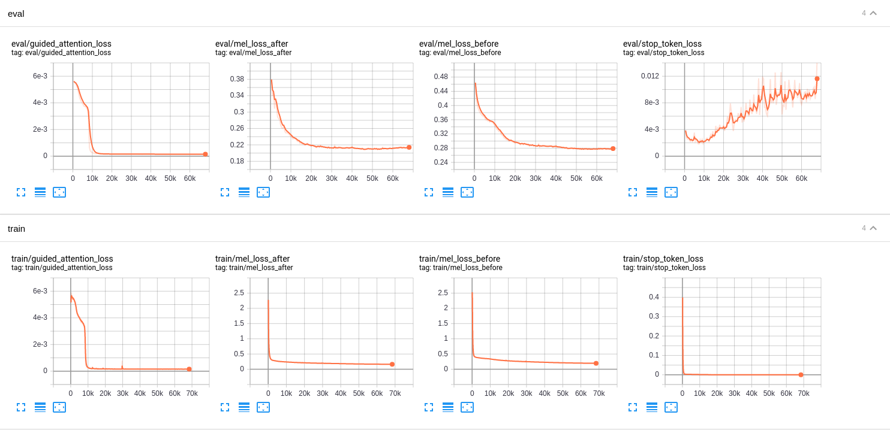

# Tacotron 2
Based on the script [`train_tacotron2.py`](https://github.com/dathudeptrai/TensorflowTTS/blob/tacotron-2-example/examples/tacotron-2/train_tacotron2.py).

## Training Tacotron-2 from scratch with LJSpeech dataset.
This example code show you how to train Tactron-2 from scratch with Tensorflow 2 based on custom training loop and tf.function. The data used for this example is LJSpeech, you can download the dataset at  [link](https://keithito.com/LJ-Speech-Dataset/).

### Step 1: Create Tensorflow based Dataloader (tf.dataset)
First, you need define data loader based on AbstractDataset class (see [`abstract_dataset.py`](https://github.com/dathudeptrai/TensorflowTTS/blob/tacotron-2-example/tensorflow_tts/datasets/abstract_dataset.py)). On this example, a dataloader read dataset from path. I use suffix to classify what file is a charactor and mel-spectrogram (see [`tacotron_dataset.py`](https://github.com/dathudeptrai/TensorflowTTS/blob/tacotron-2-example/examples/tacotron-2/tacotron_dataset.py)). If you already have preprocessed version of your target dataset, you don't need to use this example dataloader, you just need refer my dataloader and modify **generator function** to adapt with your case. Normally, a generator function should return [charactor_ids, char_length, mel, mel_length], here i also return guided attention (see [`DC_TTS`](https://arxiv.org/pdf/1710.08969.pdf)) to support training.

### Step 2: Training from scratch
After you redefine your dataloader, pls modify an input arguments, train_dataset and valid_dataset from [`train_tacotron2.py`](https://github.com/dathudeptrai/TensorflowTTS/blob/tacotron-2-example/examples/tacotron-2/train_tacotron2.py). Here is an example command line to training tacotron-2 from scratch:

```bash
CUDA_VISIBLE_DEVICES=0 nohup python train_tacotron2.py \
  --train-dir ./dump/train/ \
  --dev-dir ./dump/valid/ \
  --outdir ./exp/train.tacotron2.v1/ \
  --config conf/tacotron2.v1.yaml \
  --use-norm 1
  --mixed_precision 0 \
  --resume "" > log.tacotron2.v1.txt 2>&1
```

## Finetune Tacotron-2 with ljspeech pretrained on other languages
Here is an example show you how to use pretrained ljspeech to training with other languages. This does not guarantee a better model or faster convergence in all cases but it will improve if there is a correlation between target language and pretrained language. The only thing you need to do before finetune on other languages is re-define embedding layers. You can do it by following code:

```bash
pretrained_config = ...
tacotron2 = TFTacotron2(pretrained_config, training=True, name='tacotron2')
tacotron2._build()
tacotron2.summary()
tacotron2.load_weights(PRETRAINED_PATH)

# re-define here
pretrained_config.vocab_size = NEW_VOCAB_SIZE
new_embedding_layers = TFTacotronEmbeddings(pretrained_config, name='embeddings')
tacotron2.encoder.embeddings = new_embedding_layers
# re-build model
tacotron2._build()
tacotron2.summary()

... # training as normal.
```

## Results
Here is a result of tacotron2 based on this config [`tacotron2.v1.yaml`](https://https://github.com/dathudeptrai/TensorflowTTS/examples/tacotron-2/conf/tacotron2.v1.yaml)

### Alignments progress


### Learning curves


### Audio samples
You can hear some audio samples at [`audios`](https://github.com/dathudeptrai/TensorflowTTS/tree/tacotron-2-example/examples/tacotron-2/audios). This is Tacotron-2 with reduction factor = 7 and vocoder is Melgan at 2M steps.

## Some important notes
	
* This implementation use guided attention by default to help a model learn diagonal alignment faster.
* GMM attention also supported but i haven't test it yet.
* 50K steps is enough to get a best checkpoint.
* Scheduled teacher forcing is supported but training with teacher forcing give a best performance based on my experiments. You need to be aware of the importance of applying high dropout for prenet (both training and inference), this will reduce the effect of prev mel, so in an inference stage, a noise of prev mel prediction won't affect too much to a current decoder.
* If an amplitude levels of synthesis audio is lower compared to original speech, you may need multiply mel predicted to global gain constant (eg 1.2).

## Reference

1. https://github.com/Rayhane-mamah/Tacotron-2
2. https://github.com/mozilla/TTS
3. https://github.com/tensorflow/addons
4. https://github.com/espnet/espnet
5. [Natural TTS Synthesis by Conditioning WaveNet on Mel Spectrogram Predictions](https://arxiv.org/abs/1712.05884)
6. [Generating Sequences With Recurrent Neural Networks](https://arxiv.org/abs/1308.0850)